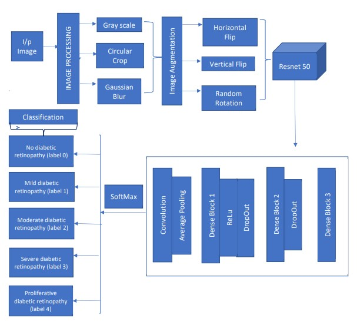
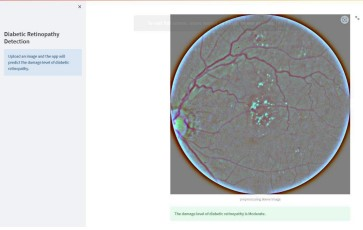

# RetinoAI: Advanced Diabetic Retinopathy Staging - A Deep Learning Method for Classifying Diabetic Retinopathy Stages

## Abstract
Diabetic retinopathy, a serious complication of diabetes that can lead to blindness if untreated, affects the retina's blood vessels and may have no early symptoms. Regular comprehensive dilated eye exams are crucial for early detection and treatment. However, accurate stage identification often requires expert analysis of fundus images, which is challenging and costly. To address this, we propose a deep learning-based method using convolutional neural networks (CNNs) for automatic diabetic retinopathy stage detection from single fundus photographs. Our approach also incorporates a multistage transfer learning technique to leverage similar datasets with varied labeling, offering a cost-effective screening solution for early detection.

## Understanding Diabetic Retinopathy: A Medical Overview
For a slight introduction to Diabetic Retinopathy, please refer to the document titled **"Diabetic Retinopathy: Medical Overview"**.
Diabetic Retinopathy progresses in 4 stages:
1. Mild non-proliferative retinopathy: the earliest stage, where only microaneurysms 
can occur.
2. Moderate non-proliferative retinopathy: a stage which can be described by losing 
the blood vessels’ ability of blood transportation due to their distortion and swelling 
with the progress of the Disease.
3. Severe non-proliferative retinopathy: results in deprived blood supply to the retina 
due to the increased blockage of more blood vessels, hence signaling the retina for 
the growing of fresh blood vessels; 
4. Proliferative diabetic retinopathy: It is the advanced stage, where the growth 
features secreted by the retina activate proliferation of the new blood vessels, 
growing along inside covering of retina in some vitreous gel, filling the eye. 

Each stage has its characteristics and particular properties, so doctors possibly could 
not take some of them into account, and thus make an incorrect diagnosis. So this 
leads to the idea of creation of an automatic solution for DR detection.

## Problem Statement
This is a 5 Class Image Classification Task based on a Kaggle dataset 
from Eye Images (Aravind Eye hospital) - APTOS 2019 Challenge. The goal is to 
predict the Blindness Stage (0-4) class from the Eye retina Image using Deep 
Learning Models (CNN).
Here, we consider 5 stages of diabetic retinopathy:
1. No diabetic retinopathy (label 0)
2. Mild diabetic retinopathy (label 1)
3. Moderate diabetic retinopathy (label 2)
4. Severe diabetic retinopathy (label 3)
5. Proliferative diabetic retinopathy (label 4)

## System Architecture
This project's system architecture begins by collecting a dataset of retinal images 
from diabetic patients, followed by preprocessing to normalize the images' size 
and color. Gaussian blur is applied to remove any artifacts or noise. Data 
augmentation techniques such as rotations, translations, scaling, and flipping are 
applied to increase the dataset's diversity. The dataset is split into training, 
validation, and testing sets. A ResNet50 model is used as a feature extractor, and a 
CNN model is built to classify the images based on the extracted features. The 
CNN model is trained using the extracted features as inputs and the ground truth 
labels as outputs. Hyperparameter tuning is conducted to fine-tune the model's 
performance, and the model is deployed in a production environment.

  

The project flow is as mentioned below:
1. Data collection
2. Data preprocessing
3. Data augmentation
4. Split the data
5. Transfer learning
6. CNN model
7. Training
8. Hyperparameter tuning
9. Testing
10. Deployment

The Summary of the steps we followed:
1. **Data collection**: Collect a large dataset of retinal images from diabetic 
patients, including both normal and diseased images.
    - The dataset can be accessed via this link from kaggle: [Blindness_Detection](https://www.kaggle.com/competitions/aptos2019-blindness-detection/data).
3. **Data preprocessing**: Preprocess the images to normalize their size and 
color, and remove any artifacts or noise. Apply Gaussian blur to smooth 
out any minor variations in the images.
    - To extract the features from the retina images,we preprocessed given images 
using:
       - **Gaussian Blur**: It is a method of blurring an image by convolving the image with 
a gaussian filter.The blur effect is achieved by averaging the colors of the pixels 
in the image. 
       - **Circular cropping**: We found that the size of an image can further reduced by 
focusing only on the circular retina part from the image.So we tried to crop the 
image circularly ,which reduced the size of image to some extent.

3. **Data augmentation**: Augment the images by applying various 
transformations such as rotations, translations, scaling, and flipping. This 
helps increase the diversity of the dataset and improves the robustness of 
the model.
    - This approach was adopted because the initial class distribution in the dataset was imbalanced. To address this, we used data augmentation techniques, including rotations, translations, scaling, and flipping, to increase the dataset size and achieve a more balanced distribution.
4. **Split the data**: Split the dataset into training, validation, and testing sets.
5. **Transfer learning**: Use a pre-trained ResNet50 model as a feature 
extractor, and freeze its layers. Extract the features from the augmented 
dataset using the ResNet50 model.
6. **CNN model**: Build a CNN model to classify the retinal images based on 
the extracted features. The CNN model can consist of multiple layers, 
including convolutional layers, pooling layers, and fully connected layers.
7. **Training**: Train the CNN model using the extracted features as inputs, and 
the ground truth labels as outputs. This involves initializing the model, 
defining the loss function, optimizing the model parameters, and 
evaluating the model's performance on the validation set.
    - We have trained 2 different types of models:
      1. Using Pre-Trained ResNet-50 model weights alone.
      2. Using ResNet-50 + engineered layers(as shown in the architecture).
8. **Hyperparameter tuning**: Experiment with different hyperparameters such 
as learning rate, batch size, and number of epochs to fine-tune the model's 
performance.
9. **Testing**: Evaluate the trained model on the testing set to measure its 
accuracy, precision, recall, and F1 score.

10. **Deployment**: Deploy the model in a production environment, such as a 
mobile app or web service, where it can be used to classify retinal images 
as normal or diseased.
    - we have built an user interface (UI) for diabetic retinopathy detection using Streamlit, a popular library for creating web applications in Python.

## Final Presentation of the project
A presentation summarizing the entire project is available in the file named **"RetinoAI_Final_PPT"** and project Report in the file named **"RetinoAI_Report"**.
